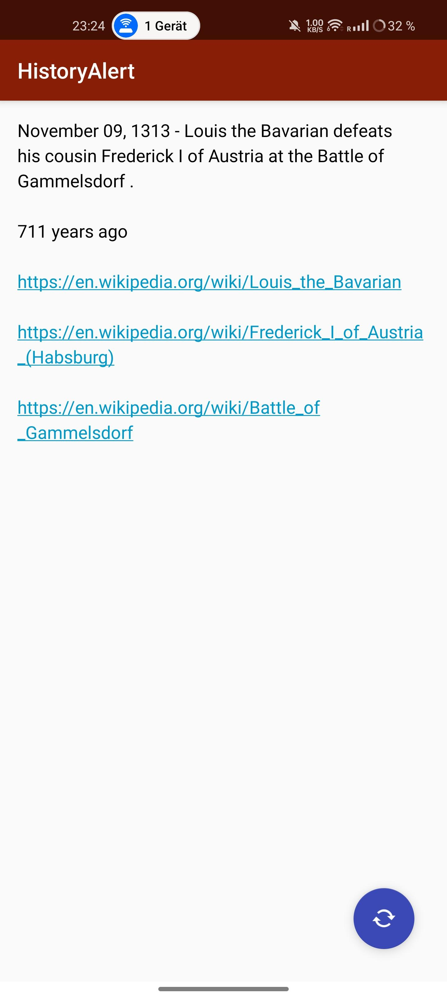
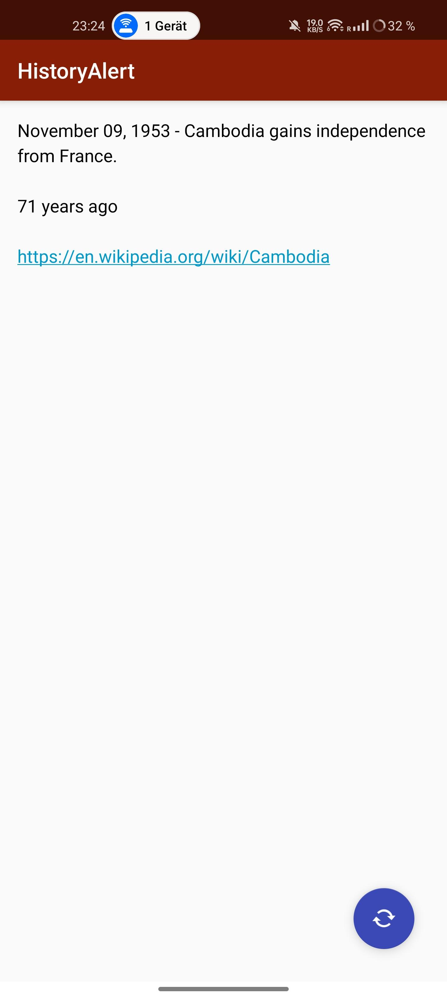
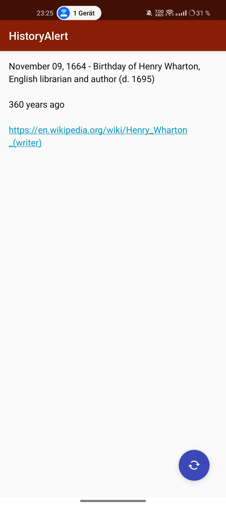
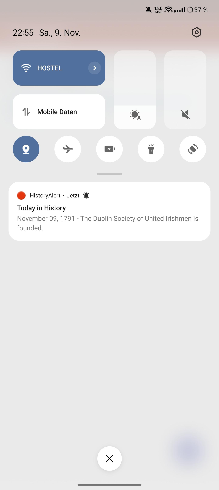
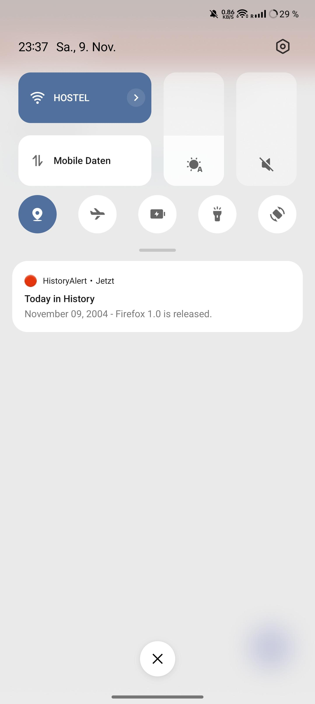

# HistoryAlert for Android

This app provides you with historical events that occurred on this day in past years. Each day, you'll receive a notification featuring a randomly selected event from today’s date in history. Tapping the notification opens more details and includes links to relevant Wikipedia pages.

The app functions entirely offline, using pre-collected data sourced from Wikipedia.

|  |  |  |
|-----------------------------------------|-----------------------------------------|-----------------------------------------|

|  |  |  |
|-----------------------------------------|-----------------------------------------|-----------------------------------------|
